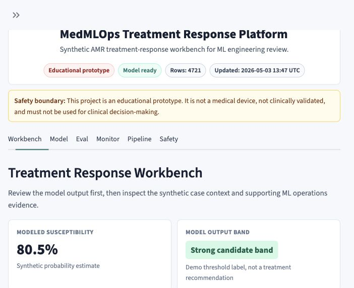
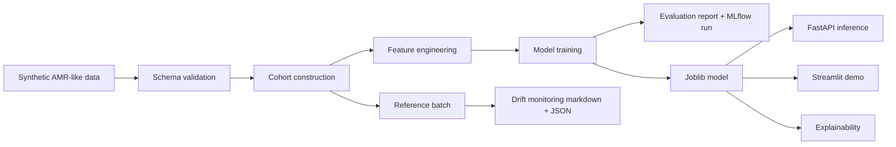

# MedMLOps Treatment Response Platform

[](https://github.com/Omarlaouan/medmlops-treatment-response-platform/actions/workflows/ci.yml)

A mini MLOps platform for explainable treatment-response prediction in healthcare.

## Overview

This repository is a GitHub-ready MVP that simulates a healthcare ML pipeline for antimicrobial resistance and antibiotic susceptibility prediction. It covers synthetic data generation, data validation, cohort construction, feature engineering, model training, evaluation, inference, explainability, monitoring, a FastAPI service, and a Streamlit demo.

This project uses synthetic AMR-like data for reproducibility. The objective is to demonstrate an MLOps architecture, not to produce a clinically valid antibiotic recommendation system.

## What This Demonstrates

- production-minded healthcare ML project structure
- reproducible synthetic data generation and cohort construction
- schema validation before modeling
- explainable scikit-learn baseline training
- MLflow experiment tracking
- threshold, calibration, and slice evaluation
- FastAPI model serving with metadata endpoints
- Streamlit reviewer demo
- structured drift monitoring
- Docker packaging and GitHub Actions CI
- model governance documentation and explicit clinical limitations

## Demo Screenshot



## Why This Project

Treatment-response prediction is a realistic healthcare AI problem: patient context, microbiology context, local resistance patterns, and prior exposure all affect whether a treatment is likely to work. This project shows how that kind of model can be wrapped in an industrializable workflow with validation, reproducibility, serving, monitoring, and clear clinical limitations.

## Important Disclaimer

This project is an educational prototype. It is not a medical device, not clinically validated, and must not be used for clinical decision-making.

## Use Case

The demo predicts synthetic antibiotic susceptibility for antimicrobial resistance-like records. The target is:

- `susceptible = 1`: synthetic isolate is susceptible
- `susceptible = 0`: synthetic isolate is resistant or intermediate

The model estimates probability of susceptibility and maps that probability to a simple recommendation level for demonstration only.

## Architecture



## Repository Structure

```text
medmlops-treatment-response-platform/
├── api/                    # FastAPI service
├── app/                    # Streamlit app
├── data/                   # Raw, processed, and reference batches
├── models/                 # Trained model artifact
├── notebooks/              # Lightweight notebook placeholders
├── reports/                # Model card and generated reports
├── src/                    # Data, features, training, inference, explainability, monitoring
├── tests/                  # Pytest suite
├── Dockerfile
├── docker-compose.yml
├── Makefile
├── requirements.txt
└── README.md
```

## Dataset

Data is generated locally with realistic synthetic signal:

- prior antibiotic exposure lowers susceptibility probability
- ICU ward lowers susceptibility probability
- higher local resistance lowers susceptibility probability
- higher comorbidity score lowers susceptibility probability
- pathogen-antibiotic pairs influence susceptibility
- nitrofurantoin performs well for urinary E. coli
- vancomycin is relevant for Staphylococcus aureus and Enterococcus faecalis, not Gram-negative pathogens
- meropenem generally has high activity but is penalized by ICU, prior exposure, and high resistance
- amoxicillin has lower activity for many pathogens

No private, credentialed, or clinical datasets are required.

## How To Run Locally

Use Python 3.11 or newer.

```bash
make install
make all
```

Manual workflow:

```bash
python -m src.data.generate_synthetic_amr --n-rows 10000 --output data/raw/synthetic_amr.csv
python -m src.data.validate_schema --input data/raw/synthetic_amr.csv
python -m src.data.build_cohort --input data/raw/synthetic_amr.csv --output data/processed/cohort.csv --infection-site urinary
python -m src.training.train --input data/processed/cohort.csv --model-output models/treatment_response_model.joblib
python -m src.monitoring.drift_report --reference data/reference/reference_batch.csv --current data/processed/cohort.csv --output reports/drift_report.md
pytest
```

## API Example

Start the API:

```bash
make api
```

Example request:

```bash
curl -X POST "http://localhost:8000/predict" \
  -H "Content-Type: application/json" \
  -d '{
    "age": 67,
    "sex": "F",
    "ward_type": "medical",
    "infection_site": "urinary",
    "pathogen": "E. coli",
    "antibiotic": "nitrofurantoin",
    "prior_antibiotic_exposure": 0,
    "comorbidity_score": 2,
    "local_resistance_rate": 0.12
  }'
```

The response includes probability of susceptibility, recommendation level, explanation, and the required educational disclaimer.

Additional endpoints:

- `GET /health`
- `GET /metadata`
- `GET /model-info`

## Streamlit Demo

Start the demo:

```bash
make app
```

The Streamlit app calls the local Python prediction function directly so the demo remains simple and reproducible.

## Modeling Approach

The baseline model is a scikit-learn pipeline:

- numeric preprocessing with `StandardScaler`
- categorical preprocessing with `OneHotEncoder(handle_unknown="ignore")`
- `LogisticRegression(max_iter=1000, class_weight="balanced")`

This is intentionally simple and explainable. It is a suitable baseline for showing MLOps structure without hiding the workflow behind heavy tooling.

## Experiment Tracking

Training logs an MLflow run when `mlflow` is installed:

- parameters: model type, split seed, cohort size, feature lists
- metrics: ROC-AUC, accuracy, precision, recall, F1, Brier score
- artifacts: model, evaluation report, predictions, reference profile, model card

Start the MLflow UI:

```bash
make mlflow-ui
```

Then open `http://localhost:5000`.

## MLOps Components

- synthetic data generation
- schema and range validation
- cohort construction
- reproducible train/test split
- model artifact saved with joblib
- MLflow experiment tracking
- evaluation report
- FastAPI serving
- Streamlit demo
- lightweight explainability
- structured drift monitoring
- pytest tests
- Docker and Docker Compose
- linting with Ruff
- GitHub Actions CI
- model card

## Evaluation

Training produces:

- ROC-AUC
- accuracy
- precision
- recall
- F1
- Brier score
- threshold tradeoff table
- calibration summary
- per-slice metrics by ward, pathogen, antibiotic, prior exposure, and comorbidity bucket

The generated report is written to `reports/evaluation_report.md`, and test-set predictions are written to `data/processed/test_predictions.csv`.

## Monitoring

The drift report compares `data/reference/reference_batch.csv` to the current cohort and flags:

- numeric mean shifts
- categorical distribution changes
- new categories
- missingness shifts
- target-rate changes greater than 0.05

Generate it with:

```bash
make monitor
```

The monitor writes both `reports/drift_report.md` and `reports/drift_report.json`.

## Project Quality

Run all local checks:

```bash
make check
```

The CI workflow runs linting, a pipeline smoke test, pytest, and a Docker build.

## Model Card

The model card is in `reports/model_card.md`. It documents intended use, non-use, dataset, target, features, metrics, explainability, deployment considerations, monitoring needs, and clinical limitations.

The clinical safety note is in `reports/clinical_safety_note.md`.

## Limitations

- Synthetic data only
- Not clinically validated
- No causal treatment effect modeling
- No organism-specific breakpoint rules
- No dose, route, allergy, renal function, source-control, or stewardship rules
- No prospective validation
- No subgroup fairness validation
- Calibration is demonstrated on synthetic data only

## Future Work

- connect to credentialed datasets such as PhysioNet AMR-UTI or ARMD-MGB after proper access approval
- add MLflow model registry and promotion workflow
- add calibration monitoring
- add subgroup fairness analysis
- add FHIR/OMOP-compatible cohort builder
- add CI/CD deployment
- add real clinical validation workflow

## Relevance To Healthcare AI Companies

This project is relevant for:

- treatment response prediction
- antimicrobial resistance
- patient-level AI
- clinical decision-support infrastructure
- data validation and monitoring in healthcare ML

It demonstrates how a healthcare ML model can be moved beyond a notebook into a small but credible operational system.

## License

This project is released under the MIT License. See `LICENSE`.
